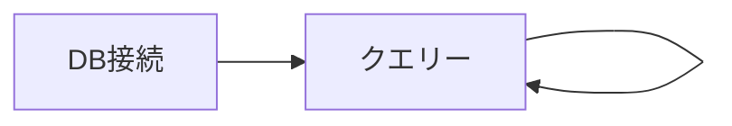

# pgMinRO

## 概要

* PostgreSQLの参照専用クライアント
* ブラウザ上から任意のSELECT文を実行して、結果を表示する軽量ツール

## 画面遷移



## 動作要件

* Go（version 1.22以降）がインストールされていること

例

```ShellSession
$ go version
go version go1.22.4 linux/amd64
```

## 使い方

### 依存モジュールの準備

```Shell
go mod tidy
```

### 起動

```Shell
go run .
```

### ブラウザからアクセス

`http://localhost:8432/`
